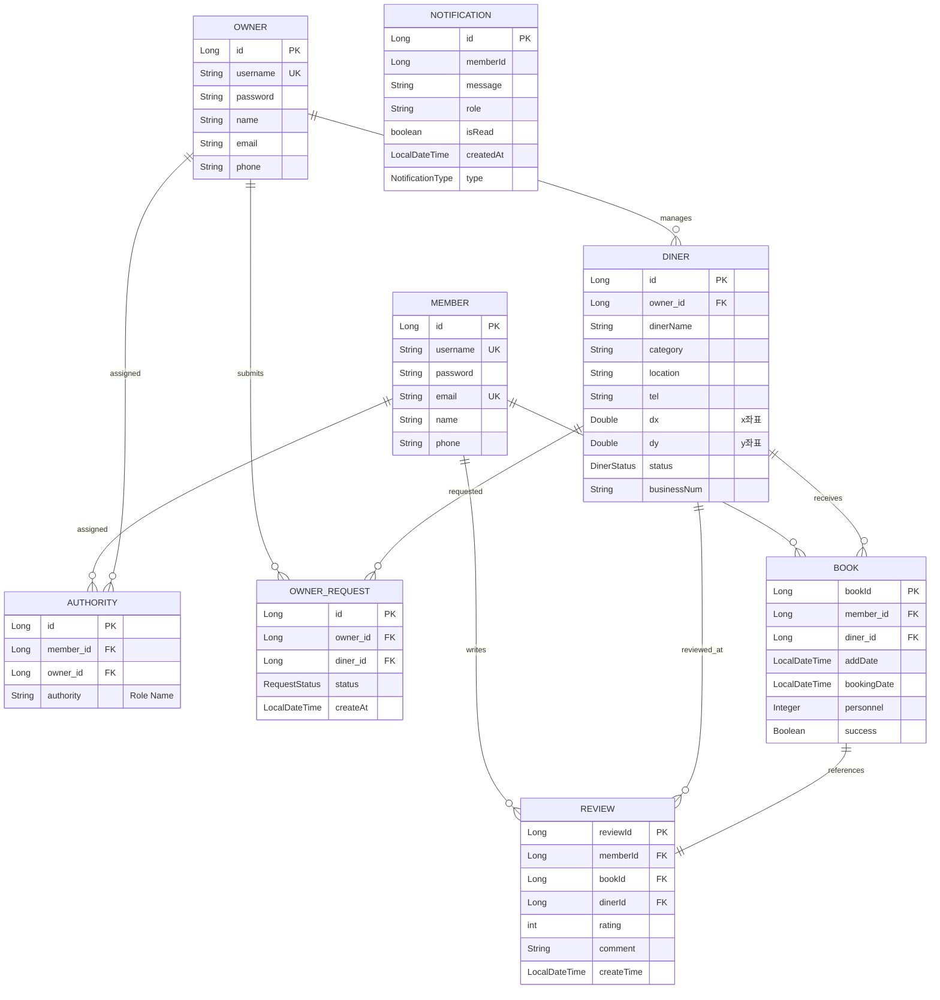

# 🍽️ TableGrap


> **대량의 식당 데이터를 효율적으로 관리하고 예약하는 플랫폼**

## 📖 Project Overview

**TableGrap**은 엑셀 파일로 된 대량의 식당 데이터를 손쉽게 업로드하고, 이를 분석하여 사용자에게 예약 및 조회 서비스를 제공하는 웹 애플리케이션입니다.
단순한 CRUD를 넘어, **비정형 데이터(식당 이름/카테고리) 정제 알고리즘**과 **Geocoding API를 활용한 위치 기반 서비스**를 중점적으로 구현했습니다.

## 🛠️ Tech Stack
- **Language**: Java 21
- **Framework**: Spring Boot 4.0.0
- **Build Tool**: Gradle
- **Database**: H2 Database (File Mode for Persistence)
- **Frontend**: Thymeleaf, HTML/CSS, Vanilla JS
- **Security**: Spring Security (Role-based Auth)
- **API**: Naver Maps API (Geocoding), Naver Search API (Category), Bizno API (Business registration number)

## 🌟 Key Features
> 수정 필요

### 1. 엑셀 데이터 파싱 및 자동 카테고리 분류
- **문제**: 원본 데이터의 카테고리가 불분명하거나 '기타'로 되어있는 경우가 많음.
- **해결**: 기타 카테고리의 데이터를 검색 API 를 사용하여 **분류 알고리즘** 구현
    - 정규표현식(Regex)과 Enum을 활용하여 분류 정확도 향상.
    - `Enum` 기반 설계를 통해 키워드 관리의 유지보수성 증대.

### 2. Geocoding & 데이터 영속성 관리
- 주소 데이터를 기반으로 위도/경도 좌표를 자동 추출하여 시각화 기반 마련.
- 중복 데이터 업로드 방지 로직을 통해 불필요한 API 호출 비용 절감.

### 3. 사용자 권한 분리 (RBAC)
- **Admin**: 식당 엑셀 업로드, 전체 회원 관리.
- **Owner**: 본인 식당 정보 수정 및 예약 관리.
- **Member**: 식당 검색, 예약 신청, 마이페이지 조회, 리뷰 작성.

## 📂 Project Structure
```
src/
├─ main/
│  ├─ java/
│  │  └─ com.example.demo/
│  │     ├─ config/        # 보안, 초기 데이터 설정
│  │     ├─ controller/    # MVC / REST 컨트롤러
│  │     ├─ data/
│  │     │  ├─ dto/        # 요청/응답 DTO
│  │     │  ├─ enums/      # 공통 Enum
│  │     │  ├─ model/      # JPA Entity
│  │     │  ├─ repository/# Spring Data JPA
│  │     │  └─ userDetails/# Security UserDetails
│  │     ├─ service/       # 비즈니스 로직
│  │     │  └─ impl/       # 서비스 구현체
│  │     └─ DemoApplication.java
│  │
│  └─ resources/
│     ├─ static/           # CSS / JavaScript
│     └─ templates/        # Thymeleaf View
│
└─ test/
└─ java/                # 테스트 코드
```

## 🔥 Technical Issues & Solutions
> 직접 겪은 문제 중 하나 이상 종합 필요  
> 
#### ⚡ 복합 데이터 조회 시 성능 병목 해결 (Performance Optimization)

* **Issue (문제)**
    * 마이페이지 및 관리자 대시보드 진입 시, 예약 내역·리뷰·식당 정보 등 **다량의 DB 조회가 단일 시점에 집중**되어 초기 페이지 렌더링 속도가 현저히 저하되는 현상 발생.
* **Solution (해결)**
    * **UI/UX 모듈화**: 화면 구조를 기능별 탭(Tab) 단위로 분리하여 시각적 복잡도 해소 및 데이터 호출 시점 분산.
    * **비동기 지연 로딩 (Lazy Loading)**: 전체 데이터를 한 번에 가져오는 기존 방식 대신, 사용자가 특정 탭을 클릭하는 시점에만 **JavaScript Fetch API**를 호출하여 해당 데이터를 비동기적으로 로드.
    * **RESTful API 설계**: 각 탭에 필요한 데이터만 반환하는 경량 API 엔드포인트를 구축하여 데이터 전송 효율 극대화.
* **Result (결과)**
    * **초기 로딩 시간 단축**: 불필요한 초기 쿼리 실행을 방지하여 첫 화면 진입 속도 및 사용자 체감 응답 속도 대폭 개선.
    * **서버 리소스 최적화**: 사용자가 실제로 확인하는 탭의 데이터에 대해서만 서버 자원을 소모하도록 설계하여 불필요한 DB 부하 절감.

---
## 🚀 Getting Started
1. **Clone the repository**
   ```bash
   git clone [https://github.com/devqw010102/TableGrap.git](https://github.com/devqw010102/TableGrap.git)
2. **Set Application Properties**
    ```bash
    src/main/resources/application.properties 파일에 API 키 설정이 필요합니다.
3. **Run the Project**
    ```bash
   ./gradlew bootRun
4. **Access**
   - Main : <code>http://localhost:8080</code>
   - DB Console : <code>http://localhost:8080/h2-console</code>

### 🗄️ Database ERD



### 🔄 Data Processing Flow
> (예시) 데이터 흐름도 Mermaid or Diagram 으로 작성 예정
```mermaid
graph TD
    A[Excel File Upload] --> B{Category Refinement}
    B -->|Regex/Enum Matching| C[Standard Category Assigned]
    C --> D[Geocoding API Call]
    D --> E[Coordinate Data Obtained]
    E --> F{Duplicate Check}
    F -->|New Data| G[Save to H2 File Database]
    F -->|Exists| H[Skip/Update]
    G --> I[Persistence Guaranteed]